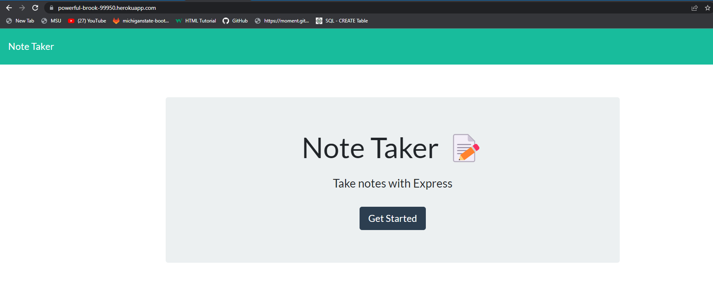
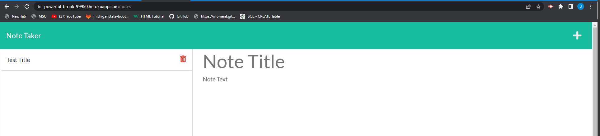
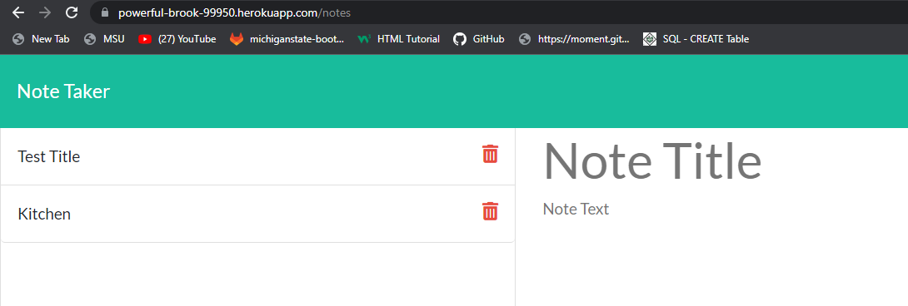

# Note Taker App

---

## Table of Contents
- [Description](#description)
- [Usage](#usage)
- [Installation](#installation)
- [Tech Used](#tech-used)
- [Page In Use](#page-in-use)
- [Questions?](#questions)
- [Contact Me](#contact-me)

---

## Description
This challenge was to create a Note Taker app that can write and save notes. The front end was already created and my job was to build th back end and connect the two. I then needed to deploy the application using Heroku!

---

## Usage
The usage of this application is to be able to take notes to organize thoughts, and keep track of tasks that need to be completed. 

---

## Installation

- Once repo was cloned run "npm i" to install nope packages
- once installed run "node server.js" to run the code and do testing of code

---

## Tech Used
- HTML
- CSS
- Bootstrap
- Javascript
- Node.js
    - Express.js
    - UUID V4
- Heroku
- Github
- VS Code

---

## Page in Use

---

## Questions?
### Contact Me
- [github](https://github.com/joncerruti)
- jonathancerruti@gmail.com